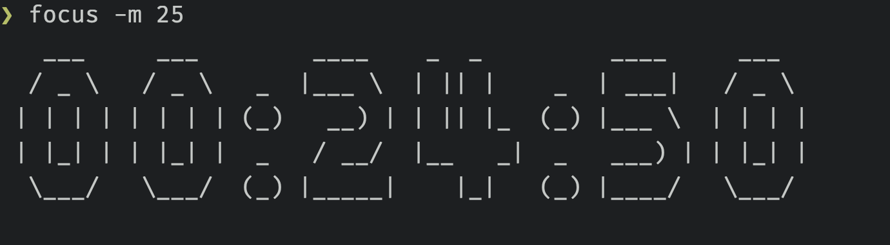

# Focus

A Pomodoro timer on the cli




## Usage

View usage with `focus -h`:

```
A Pomodoro timer on the cli

Usage: focus [OPTIONS] <-m <MINUTES>|-s <SECONDS>>

Options:
      --verbose                    Verbose debug logging
  -m <MINUTES>                     Number of minutes to run the timer for
  -s <SECONDS>                     Number of seconds to run the timer for
  -g, --message <MESSAGE>          Notification message to display, when the timer is up
      --no-sound                   Turn off melody at the end of the timer
      --no-countdown               Turn off countdown
      --no-notification            Turn off notification
      --figlet-file <FIGLET_FILE>  Supply an alternate Figlet font. See: http://www.figlet.org/fontdb.cgi
      --sound-file <SOUND_FILE>    A sound file to use. Accepted formats are .mp3, .wave, .flac and .vorbis
  -h, --help                       Print help
  -V, --version                    Print version
```

To set a basic timer of 25 mins use:

```
focus -m 25
```

Once the time completes, it will display a notification and play a sound. Both can be customised or turned off. You can also customise the [Figlet](http://www.figlet.org/) font used by supplying your own. Note, the Figlet font might need some alteration if it has extraneous tags at the end of the file. Figlet support is added through [figlet-rs](https://docs.rs/figlet-rs/latest/figlet_rs/)


## Installation

### Downloading a Release

Download the latest [release](https://github.com/ssanj/focus/releases) for your operating system (Linux or macOSX).
Make it executable with:

`chmod +x <FOCUS_EXEC>`

Copy executable to a directory on your path.


### Building through Cargo

You can build focus through Cargo with:

```
cargo install --git https://github.com/ssanj/focus
```

This will install focus into your Cargo home directory; usually `~/.cargo/bin`.

### Building from Source

Ensure you have Cargo installed.

Run:

```
cargo build --release
Copy binary file from target/release/focus to a directory on your PATH.
```
